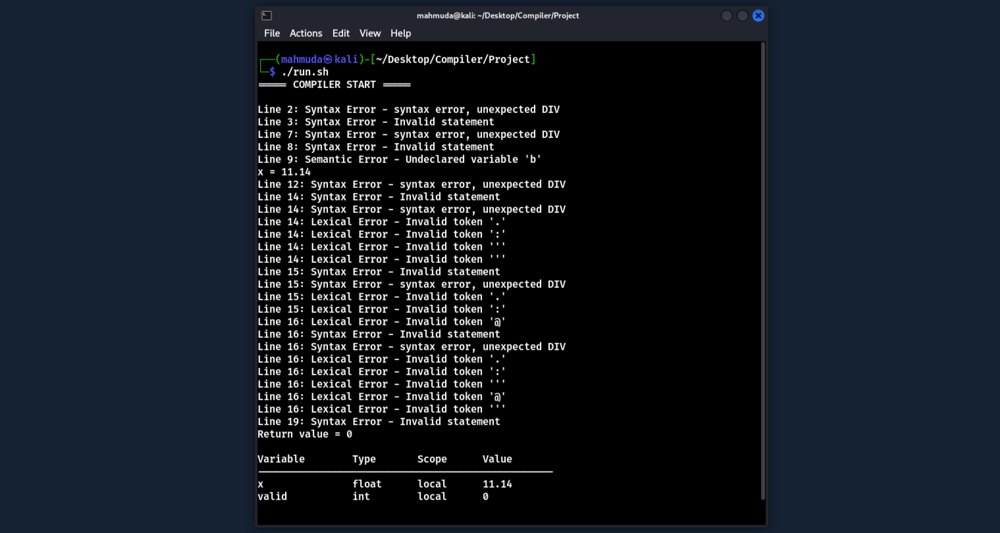

# Small Expression Compiler using Flex & Bison

This project is a small compiler developed for the **CSE-3104 Compiler Laboratory** course as part of an undergraduate academic project. It demonstrates the core phases of compiler design—including lexical analysis, syntax analysis, semantic checking, expression evaluation, and symbol table management—implemented using **Flex**, **Bison**, and **C** in Linux environment.

## Collaborator

- [Israt Jahan](https://github.com/israt2024)

## Features

- Tokenizes keywords, identifiers, numeric constants, and operators.
- Parses a simple C-like language with variable declarations, assignments, blocks, and `return` statements.
- Performs semantic checks such as undeclared-variable usage, redeclaration in the same scope, type mismatch, use-before-assignment, and division by zero.
- Evaluates arithmetic expressions, including `sqrt()` and `pow()`.
- Maintains a scoped symbol table and prints the final table after execution.

## Project Files

- `lexer.l` - Flex specification for tokenizing the source input.
- `parser.y` - Bison grammar and semantic actions.
- `symbol_table.c` / `symbol_table.h` - Symbol table implementation and interface.
- `input.txt` - Sample input program used by the compiler.
- `run.sh` - Helper script that generates parser and lexer sources, builds the compiler, and runs it on `input.txt`.

## Requirements

To build and run the project, install:

- Flex
- Bison
- GCC or another C compiler compatible with the generated sources
- `libm` and the Flex library available during linking

## Build and Run

### Using the helper script

```bash
bash run.sh
```

The script runs Flex and Bison, compiles the generated sources with `symbol_table.c`, creates the `compiler` executable, and executes it with `input.txt`.

### Manual build

```bash
flex lexer.l
bison -d parser.y
gcc lex.yy.c parser.tab.c symbol_table.c -o compiler -lfl -lm
./compiler < input.txt
```

## Output

The compiler reports:

- lexical errors
- syntax errors
- semantic errors
- assignment results
- return values
- the final symbol table

## Sample Output



